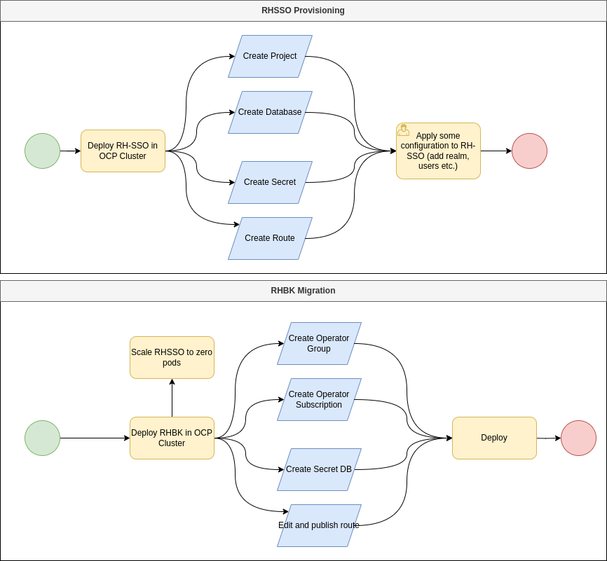

# Red Hat SSO migration to RHBK

This project perform a migration from RH SSO 7.6 to RHBK24.
Migration process is performed with "service-route-switch" approach.

## Process Diagrams



## Notice

This document is intended as a process for SSO system migration only. 
Client applications must be tested before any production migration process.
If there is an implementation with any REST Api client through SSO (RH-SSO7.*), it is strongly recommended to perform deep tests and, if needed, adapt your application pool to RHBK rest apis.
This document does not cover procedures and processes releated to client applications, extensions and rest apis implementation.  

Migration steps are described in this document:
https://access.redhat.com/documentation/en-us/red_hat_build_of_keycloak/22.0/pdf/migration_guide/red_hat_build_of_keycloak-22.0-migration_guide-en-us.pdf
Please refer to document above for any clarification.
Process may vary according to specific RHSSO configuration, modules and extensions.

Modules, add-ons and custom extensions must follow a standard "software-lifecycle", must be re-delivered and tested with the new RHBK (running with Quarkus).

Modules, templates, add-ons, extensions etc. developed for RHSSO may not work properly with RHBK.

## Project structure

```bash
.
├── commons
│   ├── 01.namespace.yml
│   └── 02.database.yml
├── kustomization.yml
├── README.md
├── rhbk
│   ├── 01.scale-zero.sh
│   ├── instance
│   │   ├── 01.rhbk.yml
│   │   ├── 02.rhbk-update-route.yml
│   │   ├── CA
│   │   │   ├── 01.certificate.sh
│   │   │   ├── 02.create-secret.sh
│   │   │   ├── certificate.pem
│   │   │   └── key.pem
│   │   └── secret
│   │       ├── 01.rhbk-tls-secret.yml
│   │       └── 02.rhbk-db-secret.yml
│   ├── kustomization.yml
│   └── operator
│       ├── 01.operator-group.yml
│       └── 02.operator-subscription.yml
└── rhsso
    ├── instance
    │   ├── 00.psql-db-secret.yml
    │   ├── 01.instance.yml
    │   └── 02.route.yml
    ├── kustomization.yml
    └── operator
        ├── 01.operator-group.yml
        └── 02.operator-subscription.yml
```

## Prerequisites

* Red Hat Openshift Cluster (>4.10)
* "oc" client installed on worksation
* "git" cli

## Clone the project

```bash
git clone https://gitlab.consulting.redhat.com/consulting-italy/company/rhsso-migration.git
cd rhsso-migration
```

## Prepare RH SSO 7.6

### Login to oc cluster
Please replace placeholders "{username}", "{password}" and "{ocp_api_url}" with your OCP credentials and api_url

```bash
oc login -u {username} -p {password} {ocp_api_url}
```

### Provision RH SSO using operator

Execute the following script from the root folder of the project

```bash
oc apply -k .
```

Script will apply the following resources to your cluster

* Create a namespace/project "sso"
* Create an Operator Group (for RH SSO)
* Create a RH SSO Subscription (RH SSO 7.6)
* Deploy a Postgresql Database
* Deploy a secret to be used for DB access
* Deploy a route to expose SSO services


At this point you will have an active, running SSO instance.
Perform any kinf of operation (add a REALM, groups, users, clients etc.)

### Migration to RHBK

#### Scale SSO to zero pods

move to folder "rhbk"

```bash
cd rhbk
```

Execute the following command:

```bash
./01.scale-zero.sh
```
This command will scale to zero pods the current SSO Instance before migration.
If you run SSO with a deployment file or use a gitops approach you can ignore this script and replace it with a YAML file patching deployment and assigning "0" to "replicas" attribute.

#### Deploy new Operator set and activate instance

Execute the following command:

```bash
oc apply -k .
```

The following "kustomization.yml" file will be applied to Openshift Cluster

```yaml
apiVersion: kustomize.config.k8s.io/v1beta1
kind: Kustomization
resources:
  - operator/01.operator-group.yml
  - operator/02.operator-subscription.yml
  - instance/secret/01.rhbk-tls-secret.yml
  - instance/secret/02.rhbk-db-secret.yml
  - instance/01.rhbk.yml
  - instance/02.rhbk-update-route.yml
```

The command above will perform the following actions:

* Configuration of OperatorGroup
* Configuration of RHBK Operator Subscription
* Creation of a TLS secret for RHBK
* Creation of a secret for database access
* Creation of a new instance of RHBK
* Update existing HTTP(s) route, switching from previous service to new RHBK

